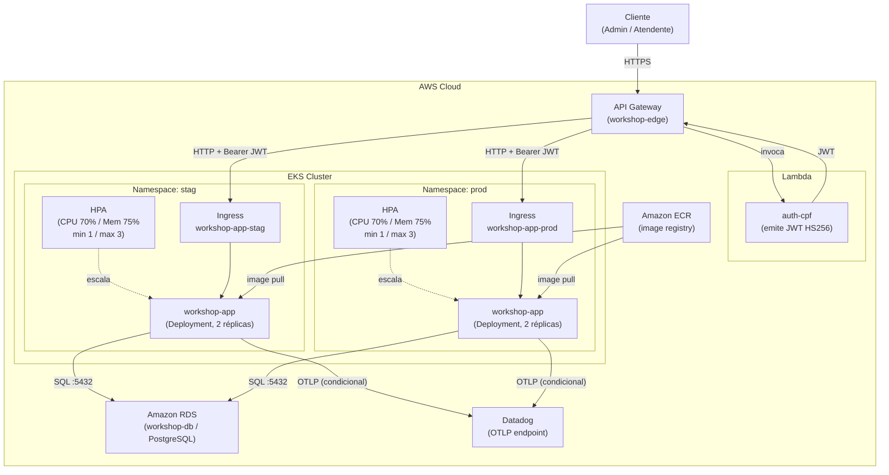
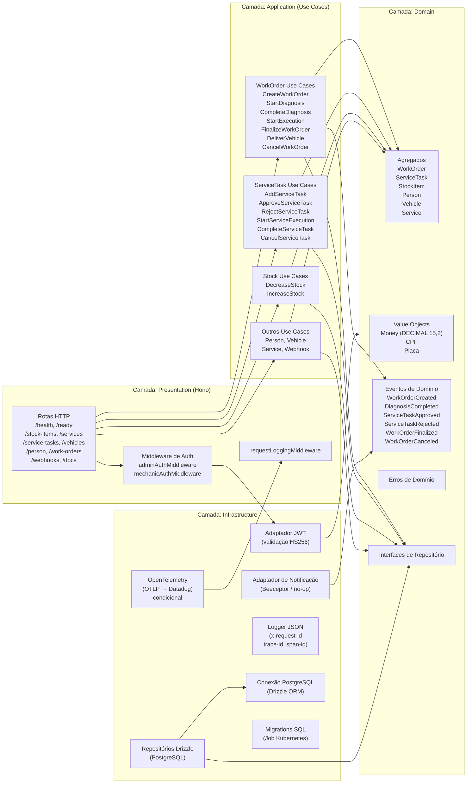

# Diagrama de Componentes — workshop-app

Este documento apresenta a visão de componentes do serviço `workshop-app`, incluindo sua posição na infraestrutura de nuvem e a estrutura interna de camadas.

---

## 1. Visão de Nuvem (AWS EKS)

O diagrama abaixo representa a topologia de nuvem completa, com os componentes externos ao repositório (API Gateway, Lambda, RDS, Datadog) e os recursos internos ao cluster EKS.

> **Nota:** A Lambda `auth-cpf`, o API Gateway, o cluster EKS, o RDS e o agente Datadog são provisionados e gerenciados fora deste repositório (`workshop-edge` e infraestrutura compartilhada). O `workshop-app` consome esses recursos mas não os provisiona.

---

## 2. Componentes Internos do workshop-app

O diagrama abaixo detalha as camadas internas da aplicação, seguindo a arquitetura limpa (Clean Architecture) com dependências fluindo apenas em direção ao domínio.

---

## 3. Legenda dos Componentes

| Componente | Camada | Responsabilidade |
|---|---|---|
| Hono Routes | Presentation | Roteamento HTTP, validação de entrada, mapeamento de erros para status HTTP |
| adminAuthMiddleware | Presentation | Valida JWT para rotas administrativas (roles: admin, front desk) |
| mechanicAuthMiddleware | Presentation | Valida JWT para rotas de mecânico |
| requestLoggingMiddleware | Presentation | Emite log JSON por request com request-id, trace-id, método, rota, status, duração |
| Use Cases | Application | Orquestra operações de domínio e persistência; não contém regras de negócio |
| Agregados | Domain | WorkOrder, ServiceTask, StockItem — fonte única de verdade para invariantes |
| Value Objects | Domain | Money (DECIMAL 15,2 BRL), CPF, placa veicular — tipos sem identidade própria |
| Eventos de Domínio | Domain | Sinalizam transições de estado; disparam notificações assíncronas |
| Interfaces de Repositório | Domain | Contratos de persistência; domínio não depende de infraestrutura |
| Drizzle Repos | Infrastructure | Implementações PostgreSQL dos repositórios de domínio via Drizzle ORM |
| JWT Adapter | Infrastructure | Valida HS256, `iss=workshop-edge`, `aud=workshop-app`, claims obrigatórios |
| Notifier | Infrastructure | Envia notificações via Beeceptor ou no-op; não altera estado de domínio |
| OpenTelemetry | Infrastructure | Exporta traces via OTLP apenas quando `OTEL_EXPORTER_OTLP_ENDPOINT` está configurado |
| Logger JSON | Infrastructure | Logs estruturados com correlação por `x-request-id` |
| API Gateway (AWS) | Externo | Ponto de entrada público; integra Lambda auth-cpf; roteia para workshop-app |
| Lambda auth-cpf | Externo | Autentica via CPF e emite JWT; mantido por `workshop-edge` |
| Amazon RDS | Externo | Instância PostgreSQL gerenciada; provisionada fora deste repositório |
| Datadog | Externo | Recebe telemetria OTLP; agente provisionado fora deste repositório |
| Amazon ECR | Externo | Registry de imagens Docker; pipeline de CI/CD publica a imagem após cada deploy |
| HPA | Kubernetes | Escala o Deployment horizontalmente com base em CPU (70%) e memória (75%) |
| Ingress | Kubernetes | Roteamento HTTP interno ao cluster para o serviço workshop-app |
