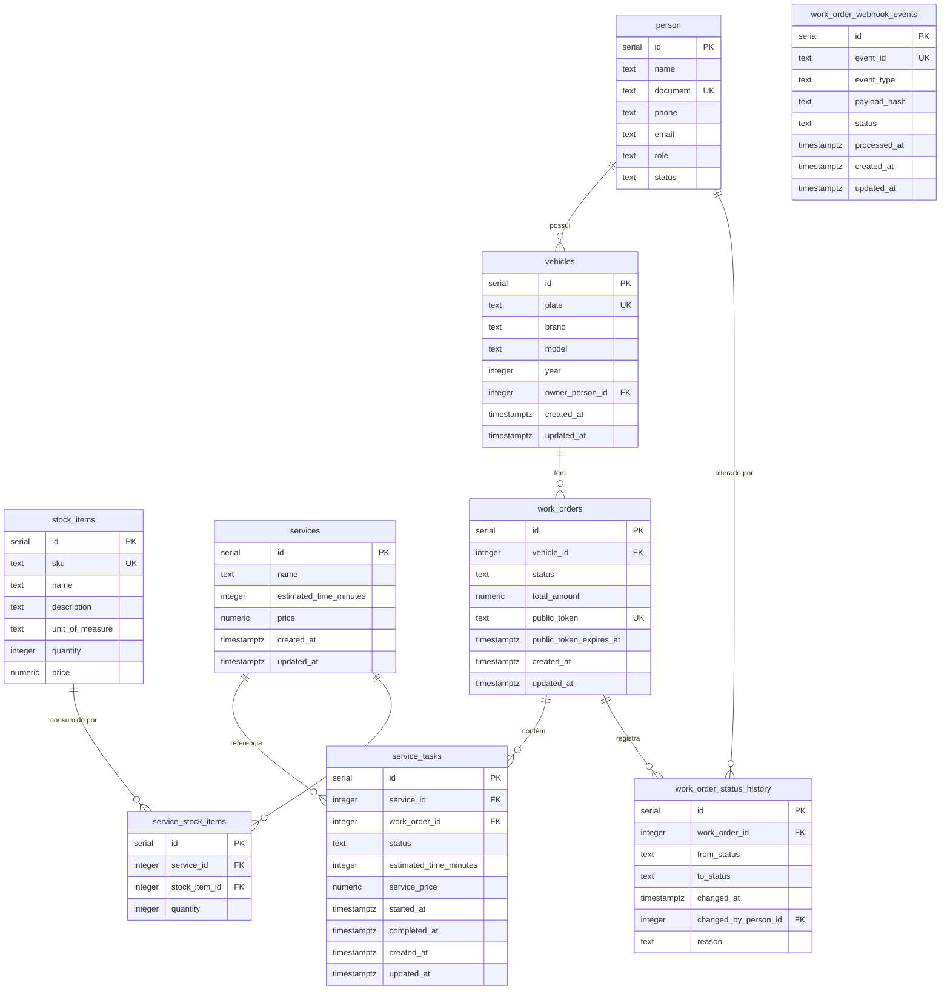

# Modelo Relacional – Workshop App

## 1. Introdução

O modelo relacional do **Workshop App** suporta o domínio de uma oficina mecânica, abrangendo o cadastro de pessoas (clientes e mecânicos), veículos, catálogo de serviços e peças em estoque, ordens de serviço (OS) com suas tarefas individuais, histórico de transições de status e registro de eventos de webhook. O esquema foi projetado segundo princípios de DDD tático, com PostgreSQL como banco de dados, e evoluiu ao longo de 13 migrations que refinaram as relações entre agregados.

---

## 2. Diagrama ER

---

## 3. Explicação das Tabelas

### 3.1 `person`

**Propósito:** Representa qualquer pessoa cadastrada no sistema – cliente, mecânico ou atendente de balcão. É a entidade raiz do contexto genérico de identidade.

**Colunas principais:**

| Coluna     | Tipo    | Descrição                                                                    |
|------------|---------|------------------------------------------------------------------------------|
| `id`       | SERIAL  | Chave primária gerada automaticamente.                                       |
| `name`     | TEXT    | Nome completo da pessoa.                                                     |
| `document` | TEXT    | CPF ou CNPJ, único no sistema.                                               |
| `phone`    | TEXT    | Telefone de contato.                                                         |
| `email`    | TEXT    | Endereço de e-mail.                                                          |
| `role`     | TEXT    | Papel da pessoa: `customer`, `mechanic` ou `front_desk`.                     |
| `status`   | TEXT    | Estado da conta: `active`, `inactive` ou `blocked`. Default: `active`.      |

**Relacionamentos:** Referenciada por `vehicles` (como proprietário) e por `work_order_status_history` (como responsável pela alteração de status).

---

### 3.2 `vehicles`

**Propósito:** Representa os veículos cadastrados na oficina. Cada veículo pertence a um proprietário e pode acumular múltiplas ordens de serviço ao longo do tempo.

**Colunas principais:**

| Coluna            | Tipo        | Descrição                                        |
|-------------------|-------------|--------------------------------------------------|
| `id`              | SERIAL      | Chave primária.                                  |
| `plate`           | TEXT        | Placa do veículo, única no sistema.              |
| `brand`           | TEXT        | Fabricante (ex.: Ford, Toyota).                  |
| `model`           | TEXT        | Modelo do veículo.                               |
| `year`            | INTEGER     | Ano de fabricação.                               |
| `owner_person_id` | INTEGER FK  | Referência ao proprietário em `person`.          |
| `created_at`      | TIMESTAMPTZ | Data/hora de criação do registro.                |
| `updated_at`      | TIMESTAMPTZ | Data/hora da última atualização.                 |

**Relacionamentos:** `owner_person_id` → `person.id`; referenciada por `work_orders`.

---

### 3.3 `stock_items`

**Propósito:** Catálogo de peças e insumos disponíveis na oficina. Controla o estoque de cada item com quantidade disponível e preço unitário.

**Colunas principais:**

| Coluna            | Tipo         | Descrição                                               |
|-------------------|--------------|---------------------------------------------------------|
| `id`              | SERIAL       | Chave primária.                                         |
| `sku`             | TEXT         | Código único do item (Stock Keeping Unit).              |
| `name`            | TEXT         | Nome do item.                                           |
| `description`     | TEXT         | Descrição opcional.                                     |
| `unit_of_measure` | TEXT         | Unidade de medida (ex.: `unidade`, `litro`).            |
| `quantity`        | INTEGER      | Quantidade disponível em estoque (≥ 0).                 |
| `price`           | NUMERIC(15,2)| Preço unitário em BRL.                                  |

**Relacionamentos:** Referenciada por `service_stock_items` (peças que um serviço consome).

---

### 3.4 `services`

**Propósito:** Catálogo de serviços oferecidos pela oficina (ex.: troca de óleo, alinhamento). Define o tempo estimado e o preço-base de cada tipo de serviço.

**Colunas principais:**

| Coluna                   | Tipo         | Descrição                                         |
|--------------------------|--------------|---------------------------------------------------|
| `id`                     | SERIAL       | Chave primária.                                   |
| `name`                   | TEXT         | Nome do serviço.                                  |
| `estimated_time_minutes` | INTEGER      | Tempo estimado de execução em minutos.            |
| `price`                  | NUMERIC(15,2)| Preço-base em BRL.                                |
| `created_at`             | TIMESTAMPTZ  | Data/hora de criação.                             |
| `updated_at`             | TIMESTAMPTZ  | Data/hora da última atualização.                  |

**Relacionamentos:** Referenciada por `service_stock_items` e por `service_tasks`.

---

### 3.5 `service_stock_items`

**Propósito:** Tabela de associação entre serviços e as peças de estoque que eles consomem. Define o "receituário" de insumos necessários para realizar um serviço. Ao iniciar a execução de uma tarefa, o estoque é decrementado com base nessa lista.

**Colunas principais:**

| Coluna          | Tipo       | Descrição                                           |
|-----------------|------------|-----------------------------------------------------|
| `id`            | SERIAL     | Chave primária.                                     |
| `service_id`    | INTEGER FK | Referência ao serviço em `services` (CASCADE DELETE).|
| `stock_item_id` | INTEGER FK | Referência ao item de estoque em `stock_items`.     |
| `quantity`      | INTEGER    | Quantidade do item consumida por execução do serviço.|

**Relacionamentos:** `service_id` → `services.id`; `stock_item_id` → `stock_items.id`.

---

### 3.6 `work_orders`

**Propósito:** Aggregate Root principal do sistema. Representa a Ordem de Serviço (OS) de um veículo, orquestrando o ciclo de vida completo desde o recebimento até a entrega.

**Colunas principais:**

| Coluna                    | Tipo         | Descrição                                                                    |
|---------------------------|--------------|------------------------------------------------------------------------------|
| `id`                      | SERIAL       | Chave primária.                                                              |
| `vehicle_id`              | INTEGER FK   | Referência ao veículo em `vehicles`.                                         |
| `status`                  | TEXT         | Status atual: `RECEIVED`, `DIAGNOSIS`, `WAITING_APPROVAL`, `READY`, `IN_EXECUTION`, `FINALIZED`, `DELIVERED`, `CANCELED`. |
| `total_amount`            | NUMERIC(15,2)| Valor total estimado da OS em BRL.                                           |
| `public_token`            | TEXT         | Token público único para acesso do cliente sem autenticação JWT.             |
| `public_token_expires_at` | TIMESTAMPTZ  | Expiração do token público.                                                  |
| `created_at`              | TIMESTAMPTZ  | Data/hora de criação.                                                        |
| `updated_at`              | TIMESTAMPTZ  | Data/hora da última atualização.                                             |

**Relacionamentos:** `vehicle_id` → `vehicles.id`; referenciada por `service_tasks` e `work_order_status_history`.

---

### 3.7 `service_tasks`

**Propósito:** Representa cada tarefa individual dentro de uma OS. Cada tarefa corresponde a um serviço do catálogo e passa por seu próprio ciclo de aprovação e execução pelo mecânico.

**Colunas principais:**

| Coluna                   | Tipo         | Descrição                                                                        |
|--------------------------|--------------|----------------------------------------------------------------------------------|
| `id`                     | SERIAL       | Chave primária.                                                                  |
| `service_id`             | INTEGER FK   | Referência ao serviço em `services`.                                             |
| `work_order_id`          | INTEGER FK   | Referência à OS em `work_orders` (NOT NULL; CASCADE DELETE).                     |
| `status`                 | TEXT         | Status: `PENDING_APPROVAL`, `APPROVED`, `REJECTED`, `IN_EXECUTION`, `COMPLETED`, `CANCELED`. |
| `estimated_time_minutes` | INTEGER      | Tempo estimado capturado no momento da criação da tarefa.                        |
| `service_price`          | NUMERIC(15,2)| Preço do serviço capturado no momento da criação (snapshot imutável).            |
| `started_at`             | TIMESTAMPTZ  | Timestamp de início da execução (nullable).                                      |
| `completed_at`           | TIMESTAMPTZ  | Timestamp de conclusão (nullable).                                               |
| `created_at`             | TIMESTAMPTZ  | Data/hora de criação.                                                            |
| `updated_at`             | TIMESTAMPTZ  | Data/hora da última atualização.                                                 |

**Relacionamentos:** `service_id` → `services.id`; `work_order_id` → `work_orders.id`.

---

### 3.8 `work_order_webhook_events`

**Propósito:** Registro de eventos de webhook recebidos externamente relacionados a ordens de serviço. Garante idempotência pelo `event_id` único e rastreabilidade pelo `payload_hash`.

**Colunas principais:**

| Coluna          | Tipo        | Descrição                                                         |
|-----------------|-------------|-------------------------------------------------------------------|
| `id`            | SERIAL      | Chave primária.                                                   |
| `event_id`      | TEXT        | Identificador único do evento (idempotência).                     |
| `event_type`    | TEXT        | Tipo do evento (ex.: `payment.approved`).                         |
| `payload_hash`  | TEXT        | Hash do payload para detecção de duplicatas adulteradas.          |
| `status`        | TEXT        | Status de processamento: `pending`, `processed`, `failed`.        |
| `processed_at`  | TIMESTAMPTZ | Timestamp de quando o evento foi processado (nullable).           |
| `created_at`    | TIMESTAMPTZ | Data/hora de recebimento.                                         |
| `updated_at`    | TIMESTAMPTZ | Data/hora da última atualização.                                  |

**Relacionamentos:** Tabela independente; não possui FK para outras tabelas (desacoplamento intencional).

---

### 3.9 `work_order_status_history`

**Propósito:** Auditoria completa de todas as transições de status de uma OS. Permite rastrear quem alterou o status, quando, por qual razão e de qual estado anterior.

**Colunas principais:**

| Coluna                  | Tipo        | Descrição                                                              |
|-------------------------|-------------|------------------------------------------------------------------------|
| `id`                    | SERIAL      | Chave primária.                                                        |
| `work_order_id`         | INTEGER FK  | Referência à OS em `work_orders`.                                      |
| `from_status`           | TEXT        | Status anterior (nullable na criação inicial da OS).                   |
| `to_status`             | TEXT        | Novo status após a transição.                                          |
| `changed_at`            | TIMESTAMPTZ | Timestamp exato da transição.                                          |
| `changed_by_person_id`  | INTEGER FK  | Referência à pessoa responsável pela mudança em `person` (nullable).   |
| `reason`                | TEXT        | Justificativa opcional para a transição.                               |

**Relacionamentos:** `work_order_id` → `work_orders.id`; `changed_by_person_id` → `person.id`.

---

## 4. Relacionamentos

### `person` → `vehicles`

Cardinalidade: **1 para N** (`||--o{`).
Uma pessoa pode possuir zero ou vários veículos. A coluna `vehicles.owner_person_id` armazena a FK. O relacionamento garante que ao consultar uma OS seja possível recuperar o cliente proprietário do veículo.

### `vehicles` → `work_orders`

Cardinalidade: **1 para N** (`||--o{`).
Um veículo pode ter múltiplas ordens de serviço ao longo do tempo (histórico de manutenções). A coluna `work_orders.vehicle_id` mantém a referência.

### `work_orders` → `service_tasks`

Cardinalidade: **1 para N** (`||--o{`).
Uma OS agrega uma ou mais tarefas de serviço. A coluna `service_tasks.work_order_id` é NOT NULL (obrigatória após migration 010), com `CASCADE DELETE`: ao cancelar/remover uma OS, todas as suas tarefas são removidas em cascata.

### `services` → `service_tasks`

Cardinalidade: **1 para N** (`||--o{`).
Cada tarefa referencia o serviço do catálogo ao qual pertence. Os campos `estimated_time_minutes` e `service_price` são copiados (snapshot) no momento da criação da tarefa para preservar o valor contratado, mesmo que o catálogo seja atualizado posteriormente.

### `services` → `service_stock_items`

Cardinalidade: **1 para N** (`||--o{`).
Um serviço pode requerer zero ou vários itens de estoque para ser executado. Essa associação define o "receituário" do serviço. Com `CASCADE DELETE`, ao remover um serviço do catálogo, suas associações de estoque são removidas automaticamente.

### `stock_items` → `service_stock_items`

Cardinalidade: **1 para N** (`||--o{`).
Um item de estoque pode ser utilizado em múltiplos serviços. Ao iniciar a execução de uma tarefa (`StartServiceExecution`), o sistema decrementa o estoque de cada item listado em `service_stock_items` para o serviço correspondente.

### `work_orders` → `work_order_status_history`

Cardinalidade: **1 para N** (`||--o{`).
Cada transição de status de uma OS gera um registro de auditoria. Permite reconstruir o histórico completo de mudanças, calcular métricas operacionais (tempo médio entre estados) e rastrear responsabilidades.

### `person` → `work_order_status_history`

Cardinalidade: **1 para N** (`||--o{`), com FK nullable.
Registra qual usuário autenticado executou a transição de status. A FK é opcional para comportar transições automáticas do sistema (sem interação humana direta).

---

## 5. Notas sobre Evolução do Modelo

### Migration 008 → 009: Criação e remoção de `service_task_parts`

A migration 008 criou a tabela `service_task_parts` com a intenção de registrar as peças consumidas **por tarefa individual** (associação `service_task_id` → `stock_items`). Após análise do domínio, decidiu-se que o consumo de peças deveria ser modelado em nível de **serviço** (catálogo), não em nível de execução individual de tarefa.

A decisão alinha-se à definição do MVP no `domain-reference.md`: o estoque é simples, sem reserva e sem rastreamento por tarefa — apenas controle de disponibilidade. A tabela `service_task_parts` foi então removida na migration 009, e o rastreamento de consumo passou a ocorrer via `service_stock_items` (peças associadas ao serviço) decretadas no momento de início da execução.

### Migration 010: `work_order_id` tornada NOT NULL em `service_tasks`

Na migration 007, a coluna `work_order_id` em `service_tasks` foi criada como nullable (`INTEGER REFERENCES work_orders(id)`). Isso abria a possibilidade de tarefas "órfãs" sem OS associada. A migration 010 corrigiu essa modelagem com `ALTER COLUMN work_order_id SET NOT NULL`, formalizando a invariante de domínio: toda tarefa de serviço pertence obrigatoriamente a uma OS.

### Migration 012: Adição de `person.status` (Fase 3 – Autenticação)

Na Fase 3 do Tech Challenge, o sistema passou a exigir controle de acesso mais granular. A coluna `status` foi adicionada à tabela `person` com três valores possíveis: `active`, `inactive` e `blocked`. O middleware de autenticação JWT do `workshop-app` rejeita com HTTP 403 qualquer requisição cujo token contenha `status !== "active"`. Isso permite bloquear usuários sem revogar tokens ainda válidos, melhorando o controle operacional sem comprometer a arquitetura stateless.

### Migration 013: Criação de `work_order_status_history` (Fase 3 – Métricas Operacionais)

Também introduzida na Fase 3, a tabela `work_order_status_history` adiciona capacidade de auditoria e análise ao sistema. Os requisitos da Fase 3 incluem métricas operacionais como tempo médio de atendimento e rastreabilidade de responsabilidade nas transições. A tabela registra `from_status`, `to_status`, `changed_at`, `changed_by_person_id` e `reason`, permitindo consultas analíticas sem modificar os agregados de domínio. Dois índices foram criados: um para busca por OS e outro para consultas por status de destino e data, otimizando as queries mais comuns de relatório.
