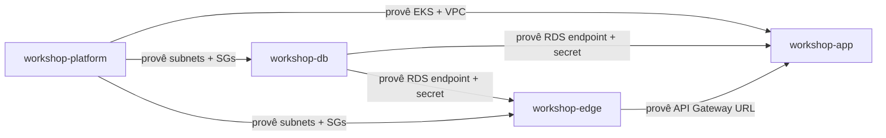

# RFC-003 — Separação em Quatro Repositórios

| Campo | Valor |
|---|---|
| **Número** | RFC-003 |
| **Status** | Aceito |
| **Data** | 2026-05-23 |
| **Repositório** | workshop-app (decisão transversal) |

---

## Contexto

O sistema `workshop` é composto por múltiplos componentes com responsabilidades distintas: aplicação de negócio, banco de dados, infraestrutura de plataforma e edge (API Gateway + Lambdas). A equipe precisou decidir como organizar o código-fonte e a infraestrutura associada.

---

## Proposta

Separar o sistema em **quatro repositórios** com responsabilidades bem definidas:

| Repositório | Responsabilidade | Stack principal |
|---|---|---|
| **workshop-app** | Aplicação de negócio (API REST, domínio, migrations) | TypeScript, Bun, Hono, Drizzle |
| **workshop-db** | Infraestrutura do banco de dados (RDS PostgreSQL) | Terraform |
| **workshop-platform** | Infraestrutura de plataforma (EKS, VPC, networking) | Terraform, Kubernetes |
| **workshop-edge** | Edge functions (API Gateway, Lambdas auth/notify/docs) | TypeScript, Terraform |

### Princípios da separação

1. **Ownership claro:** cada repositório tem um domínio único e lifecycle de deploy independente.
2. **Pipeline isolado:** mudanças em Terraform de banco não requerem rebuild da aplicação.
3. **Blast radius reduzido:** um `terraform destroy` acidental em `workshop-db` não afeta o cluster EKS.
4. **Permissões granulares:** em cenário de equipe, cada repo pode ter CODEOWNERS e branch protections específicos.

### Dependências entre repositórios

### Fluxo de provisionamento (ordem)

1. `workshop-platform` — cria VPC, EKS, namespaces
2. `workshop-db` — cria RDS na VPC provisionada
3. `workshop-edge` — cria API Gateway e Lambdas com acesso ao RDS
4. `workshop-app` — deploy da aplicação no EKS

---

## Alternativas Consideradas

### Monorepo único

Todos os componentes em um único repositório com pastas separadas (`/app`, `/db`, `/platform`, `/edge`).

**Prós:** simplicidade de checkout, refactoring cross-cutting facilitado, single CI pipeline.
**Contras:** blast radius máximo (qualquer mudança pode impactar tudo), pipeline lento (CI roda tudo a cada push), permissões all-or-nothing, dificuldade de demonstrar ownership separado.

### Dois repositórios (app + infra)

Um repositório para a aplicação e outro para toda a infraestrutura (Terraform unificado).

**Prós:** separação app/infra clara, dois pipelines.
**Contras:** o repositório de infra mistura responsabilidades muito diferentes (banco, cluster, edge), dificultando lifecycle management e rollback granular.

---

## Trade-offs

| Critério | 4 repos | Monorepo | 2 repos |
|---|---|---|---|
| Isolamento de blast radius | Alto | Baixo | Médio |
| Complexidade de CI/CD | Média | Baixa | Baixa |
| Clareza de ownership | Alta | Baixa | Média |
| Refactoring cross-cutting | Requer PRs em múltiplos repos | Simples | Simples (infra) |
| Deploy independente | Sim | Não (sem tooling extra) | Parcial |

---

## Decisão

Adotar a separação em **quatro repositórios**. A complexidade adicional de coordenação entre repos é aceitável dado:

1. **Lifecycle de deploy independente:** Terraform de infra muda raramente; app muda frequentemente.
2. **Demonstração de ownership:** atende ao requisito do challenge de mostrar separação de responsabilidades.
3. **Pipeline de promoção claro:** cada repo tem seu próprio fluxo `stag → prod` com GitHub Actions.
4. **Documentação distribuída:** cada repo mantém README e docs específicos do seu escopo, com documentação transversal centralizada em `workshop-app`.
