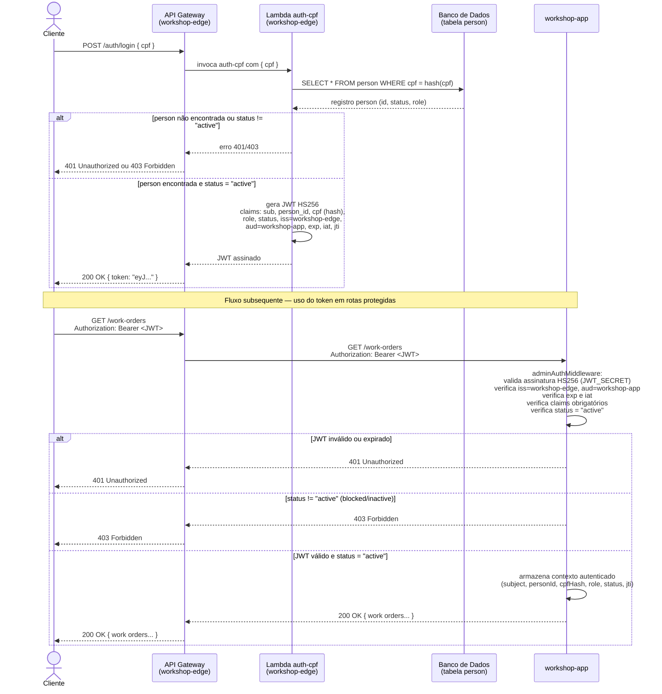
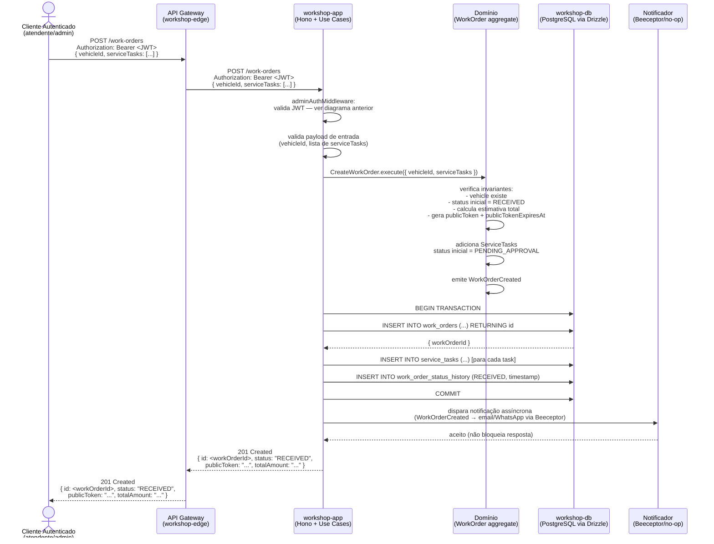

# Diagramas de Sequência — workshop-app

Este documento apresenta os principais fluxos de interação do sistema, incluindo autenticação via CPF e abertura de ordem de serviço.

---

## 1. Fluxo de Autenticação via CPF

O processo de autenticação é totalmente gerenciado pelo componente externo `workshop-edge` (API Gateway + Lambda `auth-cpf`). O `workshop-app` não emite tokens; apenas os valida.

---

## 2. Fluxo de Abertura de Ordem de Serviço

Este diagrama descreve o fluxo completo para criação de uma nova Work Order por um usuário autenticado (atendente/admin).

---

## Notas

- **Responsabilidade do workshop-edge:** A Lambda `auth-cpf` e o API Gateway são mantidos pelo repositório `workshop-edge`. O `workshop-app` não tem visibilidade da implementação interna da Lambda.
- **Correlação de requests:** Todos os logs do `workshop-app` incluem `x-request-id`, `trace-id` e `span-id` para rastreabilidade. O header `x-request-id` é propagado ou gerado automaticamente pelo `requestLoggingMiddleware`.
- **Transações:** O Drizzle ORM garante atomicidade na criação da Work Order. Falha em qualquer etapa de persistência resulta em rollback completo.
- **Notificação assíncrona:** O adaptador de notificação não bloqueia a resposta HTTP. Falhas no notificador são logadas mas não afetam o resultado da operação de domínio.
- **Middleware de autorização:** `/stock-items/*`, `/services/*`, `/vehicles/*`, `/person/*` e `/work-orders/*` usam `adminAuthMiddleware`. `/service-tasks/*` usa `mechanicAuthMiddleware`.
